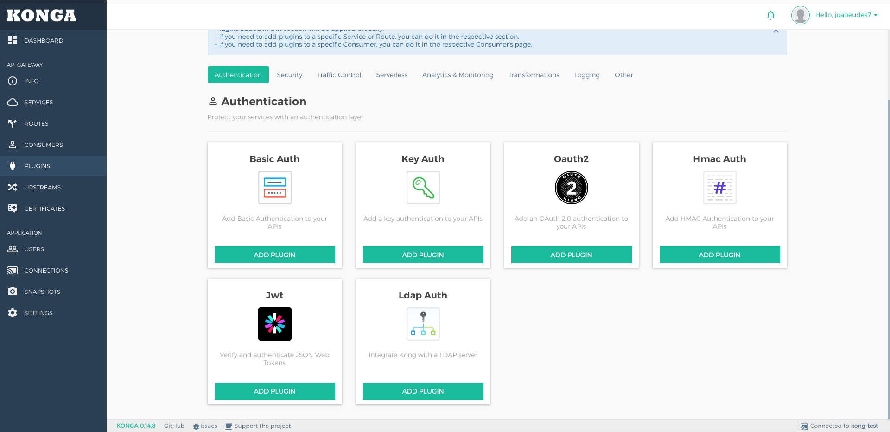

# Kong + Konga + Postgres



There are 4 services in this example:
- **kong**: API Gateway
- **kong-migration**: self-terminated container, is used to only migrate database for Kong.
- **kong-database**: Postgres database *(Kong supports Postgres and Cassandra)*
- **dashboard**: Kong GUI

##  Using:
> Init services via Docker-Compose
```
docker-compose up
```

Now the Kong will be installed installed with Konga (GUI), see Konga by [clicking here](http://localhost:1337).

After done setting upstream endpoints and running dashboard, you should be able to get list of upstream endpoints via this endpoint:

``` http://localhost:8001/apis ```

## Remove services
```
docker-compose down
```
