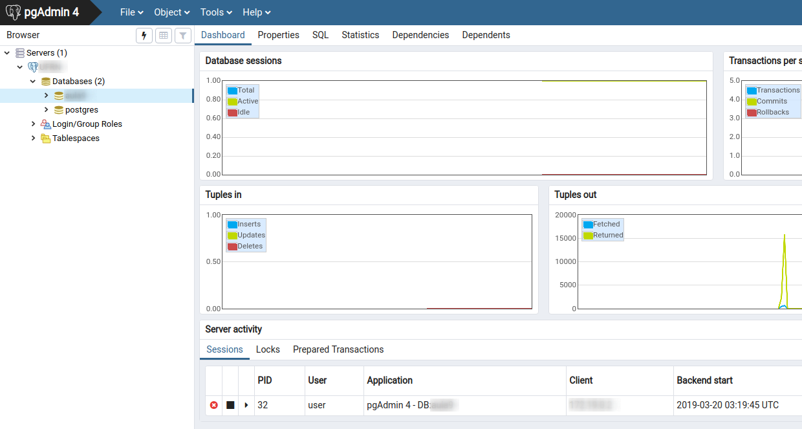

# Postgres + Pgadmin4



##  Using:
> Init via Docker-Compose
```
docker-compose up
```
Now the Postgres will now be installed with PgAdmin, see PgAdmin by [clicking here](http://localhost).

## Remove services
```
docker-compose down
```

# Attention
- See `User` e `Password` in `docker-compose.yml`
- The `restart` tag is active (ie will start together with the system at startup)
- Set `postgresql` to the` server` attribute on the Pgadmin4 page (in local programs you can use it via http://localhost:5432)
- A folder named `postgres-data` will be created at the root of this project so you don't lose your modifications made.
- Settings are in `docker-compose.yml` if you want to change and remember to remove containers after modifications
