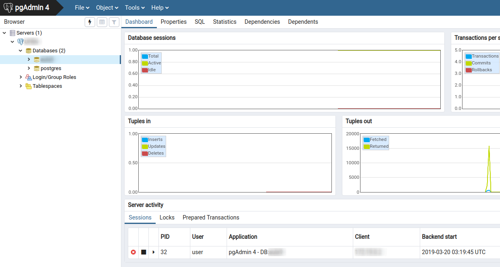

# Postgres + Adminer



## Requesitos
- [Docker instalado](https://www.digitalocean.com/community/tutorials/how-to-install-and-use-docker-on-ubuntu-18-04)
- [Docker-Copmposer instalado](https://docs.docker.com/compose/install/)

##  Modo de usar:
> Entre na pasta pelo terminal
```
cd Postgres
```
> Iniciar os containers via Docker-Compose
```
docker-compose up
```
E pronto, você já pode testar o seu banco pelo Adminer [clicando aqui](http://localhost)

## Extras
Para remover os containers dê o comando
```
docker-compose down
```

# Observações
- A tag `restart` está ativa (ou seja, irá iniciar junto com o sistema ao iniciar)
- Definir `postgresql` no atributo `server` na página Adminer (em programas locais do computador poderá utilizar o localhost:5432)
- Uma pasta chamada `postgres-data` será criada na raiz desse projeto para que não perca suas modificações feitas
- As Configurações estão no `docker-compose.yml` caso queiram alterar e lembrem-se de remover os container após as modificações
